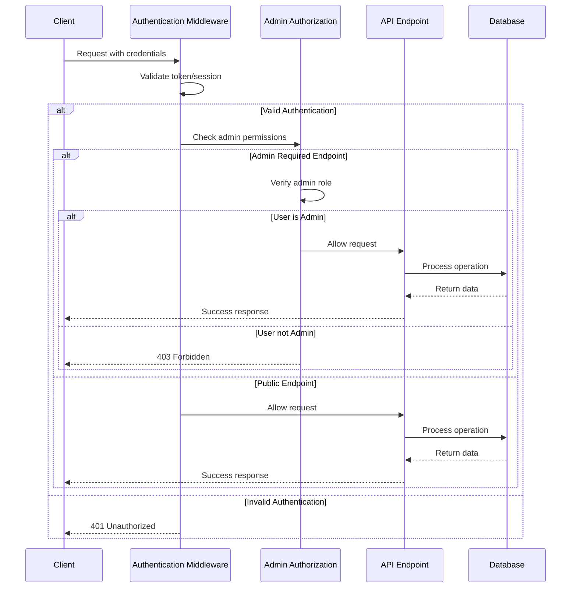
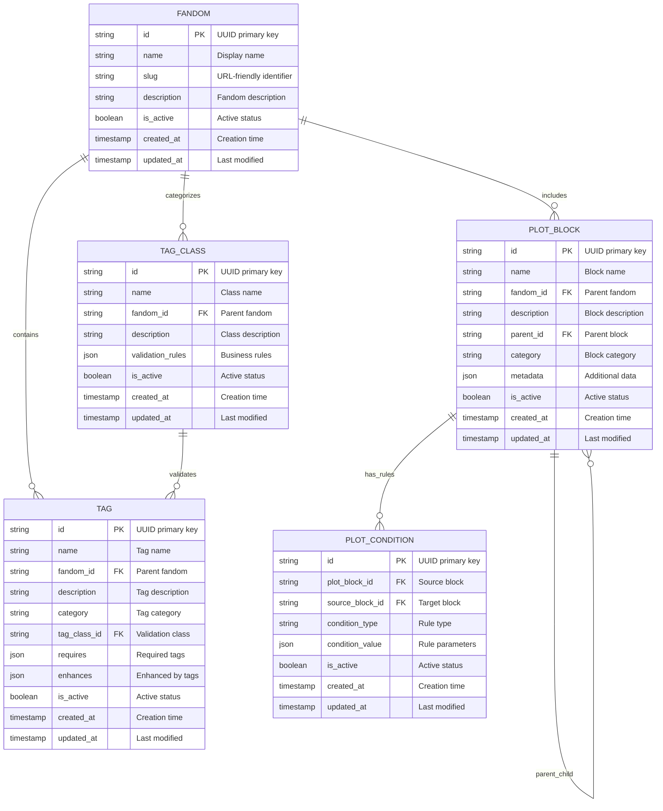
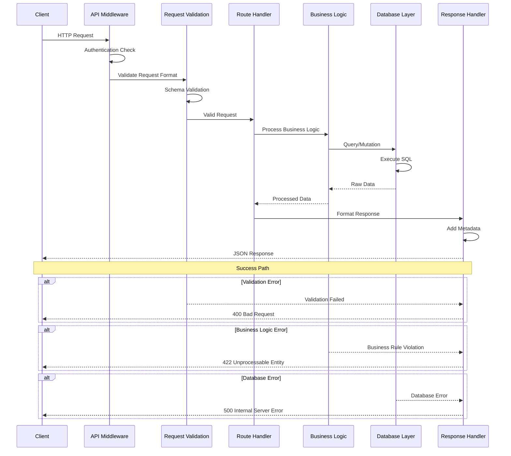
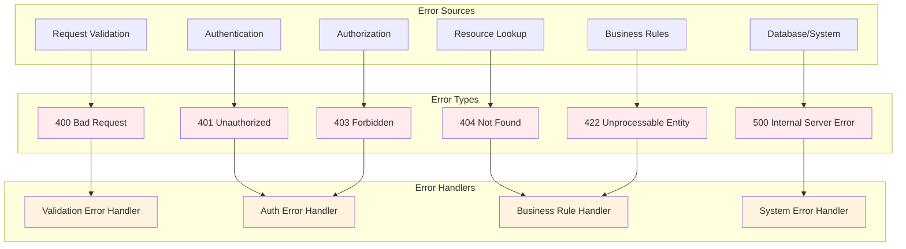

# API Documentation - The Pensive Index

## 📋 Table of Contents
1. [API Overview](#api-overview)
2. [Authentication & Authorization](#authentication--authorization)
3. [Endpoint Structure](#endpoint-structure)
4. [Data Models](#data-models)
5. [Request/Response Flow](#requestresponse-flow)
6. [Error Handling](#error-handling)

## 🌐 API Overview

The Pensive Index API is built on RESTful principles with a focus on fanfiction story discovery and management.

### API Architecture

```mermaid
graph TB
    subgraph "Client Layer"
        WEB[Web Browser]
        MOBILE[Mobile App]
        API_CLIENT[API Client]
    end

    subgraph "API Gateway Layer"
        MIDDLEWARE[Authentication Middleware]
        VALIDATION[Request Validation]
        RATE_LIMIT[Rate Limiting]
    end

    subgraph "API Endpoints"
        subgraph "Public APIs"
            HEALTH[/api/health]
            SEARCH[/api/search/stories]
        end

        subgraph "Versioned APIs (v1)"
            FANDOMS[/api/v1/fandoms]
            TAGS[/api/v1/tags]
            PLOT_BLOCKS[/api/v1/plot-blocks]
            TAG_CLASSES[/api/v1/tag-classes]
            VALIDATION_API[/api/v1/validation]
        end
    end

    subgraph "Business Logic Layer"
        DB_HELPERS[Database Helpers]
        VALIDATION_ENGINE[Validation Engine]
        QUERY_BUILDER[Query Builder]
    end

    subgraph "Data Layer"
        DATABASE[(SQLite Database)]
    end

    WEB --> MIDDLEWARE
    MOBILE --> MIDDLEWARE
    API_CLIENT --> MIDDLEWARE

    MIDDLEWARE --> VALIDATION
    VALIDATION --> RATE_LIMIT
    RATE_LIMIT --> HEALTH
    RATE_LIMIT --> SEARCH
    RATE_LIMIT --> FANDOMS
    RATE_LIMIT --> TAGS
    RATE_LIMIT --> PLOT_BLOCKS
    RATE_LIMIT --> TAG_CLASSES
    RATE_LIMIT --> VALIDATION_API

    FANDOMS --> DB_HELPERS
    TAGS --> DB_HELPERS
    PLOT_BLOCKS --> VALIDATION_ENGINE
    TAG_CLASSES --> VALIDATION_ENGINE
    VALIDATION_API --> QUERY_BUILDER

    DB_HELPERS --> DATABASE
    VALIDATION_ENGINE --> DATABASE
    QUERY_BUILDER --> DATABASE

    style WEB fill:#e3f2fd
    style MOBILE fill:#e3f2fd
    style API_CLIENT fill:#e3f2fd
    style HEALTH fill:#e8f5e8
    style SEARCH fill:#e8f5e8
    style FANDOMS fill:#fff3e0
    style TAGS fill:#fff3e0
    style PLOT_BLOCKS fill:#fff3e0
    style TAG_CLASSES fill:#fff3e0
    style VALIDATION_API fill:#fff3e0
```

### Component Descriptions:

**Client Layer**:
- **Web Browser**: Frontend web application users
- **Mobile App**: Future mobile application clients
- **API Client**: Third-party integrations and tools

**API Gateway Layer**:
- **Authentication Middleware**: Validates user credentials and permissions
- **Request Validation**: Ensures request format and data validity
- **Rate Limiting**: Prevents API abuse and ensures fair usage

**Public APIs**:
- **Health**: System status and monitoring endpoint
- **Search**: Story discovery without authentication

**Versioned APIs (v1)**:
- **Fandoms**: Manage story universes (Harry Potter, etc.)
- **Tags**: Handle story descriptors and metadata
- **Plot Blocks**: Manage story structure elements
- **Tag Classes**: Organize and validate tag groups
- **Validation**: Validate story pathway combinations

## 🔐 Authentication & Authorization

### Authentication Flow



### Permission Levels:

**Public Access**:
- **Health checks**: System status monitoring
- **Story search**: Read-only story discovery
- **Fandom browsing**: Read-only content viewing

**Admin Access** (Required for):
- **Content creation**: Adding fandoms, tags, plot blocks
- **Content modification**: Updating existing content
- **Content deletion**: Removing content
- **Validation rule management**: Defining business rules

## 🛣️ Endpoint Structure

### URL Pattern Organization

```mermaid
graph TB
    subgraph "API Structure"
        ROOT[/api/]

        subgraph "Health & Monitoring"
            HEALTH[/health]
        end

        subgraph "Public Features"
            SEARCH_ROOT[/search/]
            STORIES[stories/]
        end

        subgraph "Versioned APIs"
            V1[/v1/]

            subgraph "Core Resources"
                FANDOMS_V1[/fandoms/]
                TAGS_V1[/tags/]
                PLOT_BLOCKS_V1[/plot-blocks/]
                TAG_CLASSES_V1[/tag-classes/]
            end

            subgraph "Operations"
                VALIDATION_V1[/validation/]
            end

            subgraph "Resource Actions"
                FANDOM_ID[/{id}]
                TREE[/tree]
                VALIDATE[/validate]
                RULES[/rules]
            end
        end

        subgraph "Legacy APIs"
            LEGACY_FANDOMS[/fandoms/]
            LEGACY_FANDOM[/{fandom}/]
            LEGACY_TAGS[/tags/]
        end
    end

    ROOT --> HEALTH
    ROOT --> SEARCH_ROOT
    ROOT --> V1
    ROOT --> LEGACY_FANDOMS

    SEARCH_ROOT --> STORIES

    V1 --> FANDOMS_V1
    V1 --> TAGS_V1
    V1 --> PLOT_BLOCKS_V1
    V1 --> TAG_CLASSES_V1
    V1 --> VALIDATION_V1

    FANDOMS_V1 --> FANDOM_ID
    PLOT_BLOCKS_V1 --> FANDOM_ID
    TAGS_V1 --> FANDOM_ID
    TAG_CLASSES_V1 --> FANDOM_ID

    FANDOM_ID --> TREE
    FANDOM_ID --> VALIDATE
    VALIDATION_V1 --> RULES

    LEGACY_FANDOMS --> LEGACY_FANDOM
    LEGACY_FANDOM --> LEGACY_TAGS

    style HEALTH fill:#e8f5e8
    style STORIES fill:#e8f5e8
    style FANDOMS_V1 fill:#fff3e0
    style TAGS_V1 fill:#fff3e0
    style PLOT_BLOCKS_V1 fill:#fff3e0
    style TAG_CLASSES_V1 fill:#fff3e0
    style VALIDATION_V1 fill:#fff3e0
    style LEGACY_FANDOMS fill:#ffebee
    style LEGACY_FANDOM fill:#ffebee
    style LEGACY_TAGS fill:#ffebee
```

### Endpoint Categories:

**Health & Monitoring**:
- **GET /api/health**: System health status and metrics

**Public Features**:
- **GET /api/search/stories**: Search existing stories without authentication

**Core Resources (v1)**:
- **Fandoms**: Manage story universes and their hierarchies
- **Tags**: Handle story descriptors and metadata
- **Plot Blocks**: Manage story structure elements
- **Tag Classes**: Organize and validate tag groups

**Operations (v1)**:
- **Validation**: Validate pathway combinations and business rules

**Resource Actions**:
- **/{id}**: Individual resource operations (GET, PUT, DELETE)
- **/tree**: Hierarchical data retrieval
- **/validate**: Validation operations
- **/rules**: Rule management

## 📊 Data Models

### Core Entity Relationships



### Data Model Descriptions:

**FANDOM Entity**:
- **Primary Purpose**: Represents story universes (Harry Potter, Percy Jackson)
- **Key Fields**: name (display), slug (URL), description (overview)
- **Relationships**: Contains tags, tag classes, and plot blocks
- **Business Rules**: Must have unique slug, name within active fandoms

**TAG Entity**:
- **Primary Purpose**: Story descriptors and metadata tags
- **Key Fields**: name (tag text), category (grouping), requires/enhances (dependencies)
- **Relationships**: Belongs to fandom and tag class
- **Business Rules**: Unique name within fandom, must respect tag class validation

**TAG_CLASS Entity**:
- **Primary Purpose**: Validation groups for related tags
- **Key Fields**: name (class name), validation_rules (business logic)
- **Relationships**: Contains multiple tags, belongs to fandom
- **Business Rules**: Enforces mutual exclusion, required context, instance limits

**PLOT_BLOCK Entity**:
- **Primary Purpose**: Story structure elements and tropes
- **Key Fields**: name (block name), parent_id (hierarchy), metadata (flexible data)
- **Relationships**: Tree structure within fandom, has conditions
- **Business Rules**: Hierarchical validation, category restrictions

**PLOT_CONDITION Entity**:
- **Primary Purpose**: Rules governing plot block interactions
- **Key Fields**: condition_type (rule category), condition_value (parameters)
- **Relationships**: Links plot blocks with business rules
- **Business Rules**: Defines when blocks can/cannot be combined

## 🔄 Request/Response Flow

### Typical API Request Lifecycle



### Request Processing Steps:

1. **HTTP Request**: Client sends request to API endpoint
2. **Authentication Check**: Middleware validates credentials and permissions
3. **Request Validation**: Schema validation using Zod schemas
4. **Route Handler**: Processes request and coordinates business logic
5. **Business Logic**: Applies business rules and validation
6. **Database Layer**: Executes queries and returns raw data
7. **Response Handler**: Formats response with appropriate metadata
8. **JSON Response**: Returns structured response to client

### Error Handling Paths:

- **Validation Error**: Invalid request format or missing required fields
- **Business Logic Error**: Violates business rules or constraints
- **Database Error**: Technical database issues or constraint violations

## ⚠️ Error Handling

### Error Response Structure



### Error Code Meanings:

**Client Errors (4xx)**:
- **400 Bad Request**: Invalid request format, missing required fields
- **401 Unauthorized**: Missing or invalid authentication credentials
- **403 Forbidden**: Valid auth but insufficient permissions
- **404 Not Found**: Requested resource doesn't exist
- **422 Unprocessable Entity**: Valid format but business rule violations

**Server Errors (5xx)**:
- **500 Internal Server Error**: Database errors, system failures

### Standard Error Response Format:

```json
{
  "error": {
    "code": "VALIDATION_ERROR",
    "message": "Invalid request data",
    "details": {
      "field": "name",
      "issue": "Required field missing"
    },
    "timestamp": "2025-09-18T10:30:00Z",
    "request_id": "req_1234567890"
  }
}
```

## 📈 API Usage Examples

### Example Request Flow: Creating a Fandom

```mermaid
sequenceDiagram
    participant Admin as Admin User
    participant API as /api/v1/fandoms
    participant Auth as Auth Middleware
    participant Val as Validation
    participant DB as Database

    Admin->>API: POST /api/v1/fandoms
    Note right of Admin: { "name": "Harry Potter", "description": "..." }

    API->>Auth: Check admin permissions
    Auth-->>API: ✅ Admin confirmed

    API->>Val: Validate request schema
    Val->>Val: Check name, description format
    Val-->>API: ✅ Valid data

    API->>DB: Create fandom record
    DB->>DB: Generate UUID, set timestamps
    DB-->>API: Created fandom object

    API-->>Admin: 201 Created
    Note left of API: { "id": "uuid", "name": "Harry Potter", ... }
```



This comprehensive API structure provides a solid foundation for The Pensive Index platform, ensuring scalability, maintainability, and clear separation of concerns.