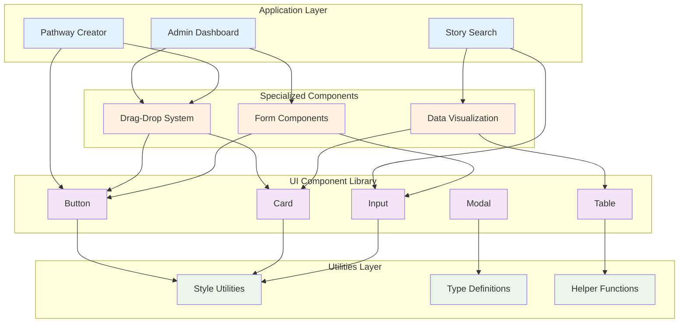
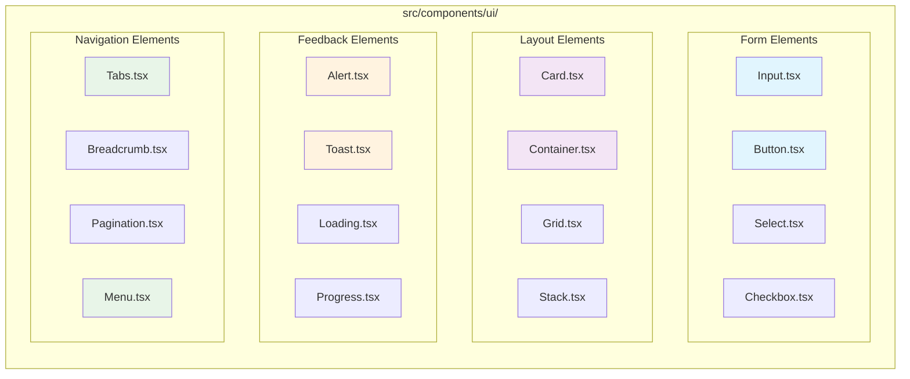
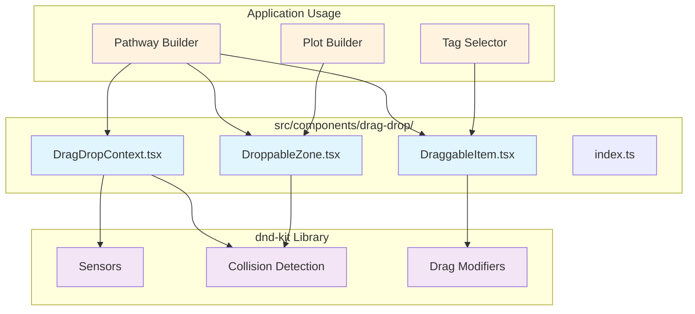
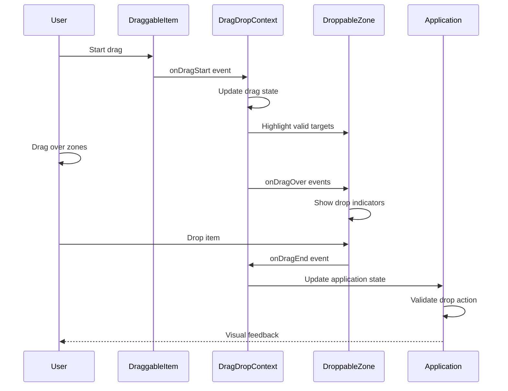
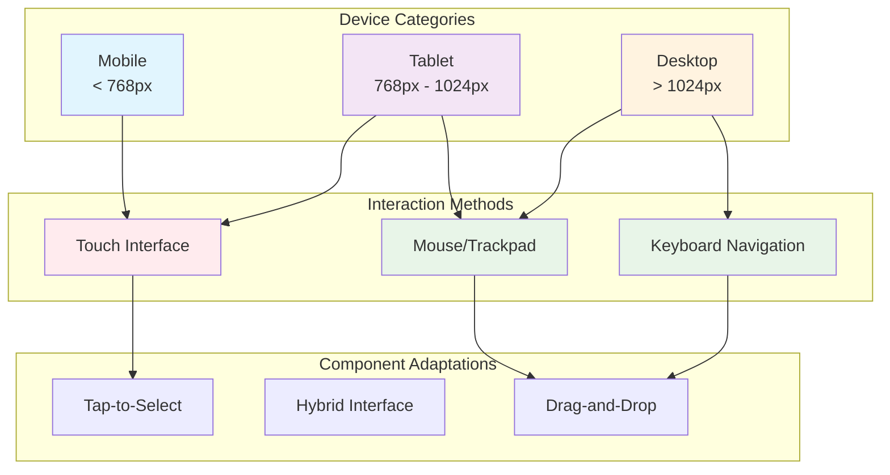
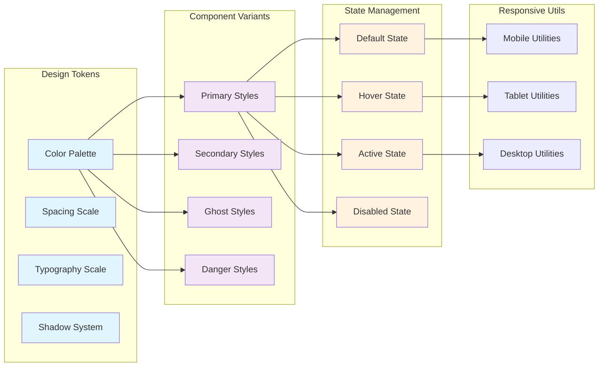
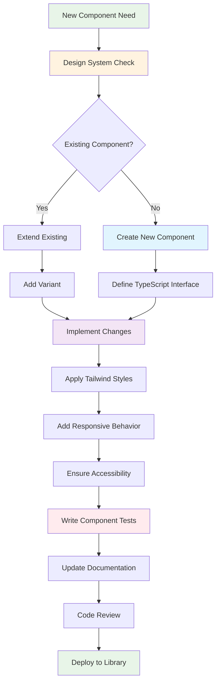

# Component System Documentation

## 🎨 Component Architecture Overview

The Pensive Index uses a layered component architecture with reusable UI elements and specialized interaction components.

### Component Hierarchy



### Layer Descriptions:

**Application Layer**:
- **Admin Dashboard**: Management interface for content creators
- **Pathway Creator**: Main user interface for building story pathways
- **Story Search**: Discovery interface for finding existing stories

**Specialized Components**:
- **Drag-Drop System**: Interactive pathway building components
- **Form Components**: Complex form handling and validation
- **Data Visualization**: Charts, graphs, and data display components

**UI Component Library**:
- **Button**: Clickable actions with various styles and states
- **Card**: Container component for grouping related content
- **Input**: Form input fields with validation and error states
- **Modal**: Overlay dialogs and popups
- **Table**: Data display with sorting and filtering

**Utilities Layer**:
- **Style Utilities**: Tailwind CSS utilities and design tokens
- **Type Definitions**: TypeScript interfaces and component props
- **Helper Functions**: Common functionality shared across components

## 🧩 UI Component Library

### Base Components Structure



### Component Categories:

**Form Elements**:
- **Input**: Text inputs, textareas, with validation states
- **Button**: Primary, secondary, ghost, and icon button variants
- **Select**: Dropdown selection with search and multi-select
- **Checkbox**: Boolean inputs with indeterminate state

**Layout Elements**:
- **Card**: Flexible container with header, body, and footer sections
- **Container**: Responsive content containers with max-width constraints
- **Grid**: CSS Grid wrapper for complex layouts
- **Stack**: Flexbox utility for vertical/horizontal spacing

**Feedback Elements**:
- **Alert**: Status messages for success, error, warning, info
- **Toast**: Temporary notifications that appear and disappear
- **Loading**: Spinner and skeleton loading states
- **Progress**: Progress bars and completion indicators

**Navigation Elements**:
- **Tabs**: Tab interface for organizing related content
- **Breadcrumb**: Navigation trail showing current location
- **Pagination**: Page navigation for large data sets
- **Menu**: Dropdown and context menus

## 🎯 Drag-Drop System

### Drag-Drop Component Architecture



### Drag-Drop Component Details:

**Core Components**:
- **DragDropContext**: Provides drag-and-drop functionality to child components
- **DraggableItem**: Makes individual elements draggable (tags, plot blocks)
- **DroppableZone**: Defines areas where draggable items can be dropped
- **index.ts**: Exports all drag-drop components and utilities

**dnd-kit Integration**:
- **Sensors**: Handle touch, mouse, and keyboard interactions
- **Collision Detection**: Determines valid drop targets during drag
- **Drag Modifiers**: Customize drag behavior (snap to grid, constraints)

**Application Usage**:
- **Pathway Builder**: Main interface for creating story pathways
- **Tag Selector**: Draggable tag selection interface
- **Plot Builder**: Constructing plot block hierarchies

### Interaction Flow



### Interaction Flow Steps:

1. **Start Drag**: User begins dragging an item
2. **Drag State**: Context tracks drag state and highlights targets
3. **Drag Over**: Visual feedback as user moves over drop zones
4. **Drop Action**: Item is dropped, triggering validation and state updates
5. **Visual Feedback**: Application provides confirmation of successful action

## 📱 Responsive Design System

### Breakpoint Strategy



### Responsive Behavior:

**Mobile (< 768px)**:
- **Touch Interface**: Optimized for finger navigation
- **Tap-to-Select**: Alternative to drag-and-drop for pathway building
- **Simplified Layouts**: Single-column layouts with clear touch targets

**Tablet (768px - 1024px)**:
- **Hybrid Interface**: Supports both touch and mouse interactions
- **Adaptive Layouts**: Two-column layouts that work for both orientations
- **Enhanced Touch Targets**: Larger interactive areas for comfort

**Desktop (> 1024px)**:
- **Drag-and-Drop**: Full drag-and-drop functionality for complex interactions
- **Multi-Panel Layout**: Three-panel interface (selection, pathway, output)
- **Keyboard Navigation**: Full keyboard accessibility support

## 🎨 Design System Integration

### Tailwind CSS Integration



### Design System Elements:

**Design Tokens**:
- **Color Palette**: Consistent colors across all components
- **Spacing Scale**: Uniform spacing using Tailwind's scale
- **Typography Scale**: Text sizes and line heights for hierarchy
- **Shadow System**: Depth and elevation through shadows

**Component Variants**:
- **Primary**: Main call-to-action styling
- **Secondary**: Supporting action styling
- **Ghost**: Minimal styling for subtle actions
- **Danger**: Warning and destructive action styling

**State Management**:
- **Default**: Base component appearance
- **Hover**: Enhanced appearance on hover/focus
- **Active**: Pressed or selected state appearance
- **Disabled**: Non-interactive state with reduced opacity

**Responsive Utilities**:
- **Mobile**: Touch-optimized spacing and sizing
- **Tablet**: Balanced approach for mixed interactions
- **Desktop**: Precise controls for mouse interactions

## 🔄 Component Development Workflow

### Component Creation Process



### Development Workflow Steps:

1. **Component Need**: Identify requirement for new component or enhancement
2. **Design System Check**: Verify alignment with design system principles
3. **Existing Component**: Evaluate if existing component can be extended
4. **Create/Extend**: Either create new component or add variant to existing
5. **Implementation**: Code the component with proper TypeScript interfaces
6. **Styling**: Apply Tailwind CSS with consistent design tokens
7. **Responsive**: Ensure component works across all device sizes
8. **Accessibility**: Implement ARIA attributes and keyboard navigation
9. **Testing**: Write unit tests and interaction tests
10. **Documentation**: Update component documentation and examples
11. **Review**: Code review for quality and consistency
12. **Deploy**: Add to component library and update exports

## 📚 Component Usage Examples

### Button Component Usage

```typescript
// Basic button usage
<Button variant="primary" size="md">
  Save Changes
</Button>

// Button with icon and loading state
<Button
  variant="secondary"
  size="lg"
  icon={<SaveIcon />}
  loading={isSubmitting}
  disabled={!formValid}
>
  Submit Form
</Button>

// Ghost button for subtle actions
<Button variant="ghost" size="sm" onClick={handleCancel}>
  Cancel
</Button>
```

### Card Component Usage

```typescript
// Basic card with content
<Card>
  <Card.Header>
    <h3>Fandom Management</h3>
  </Card.Header>
  <Card.Body>
    <p>Manage your fandoms and their settings.</p>
  </Card.Body>
  <Card.Footer>
    <Button variant="primary">Open Manager</Button>
  </Card.Footer>
</Card>

// Card with custom styling
<Card variant="elevated" padding="lg">
  <div className="space-y-4">
    <h2>Story Pathway</h2>
    <PathwayBuilder />
  </div>
</Card>
```

### Drag-Drop Usage

```typescript
// Drag-drop context setup
<DragDropContext onDragEnd={handleDragEnd}>
  <div className="flex gap-4">
    {/* Draggable items */}
    <div>
      {tags.map(tag => (
        <DraggableItem key={tag.id} id={tag.id} data={tag}>
          <TagCard tag={tag} />
        </DraggableItem>
      ))}
    </div>

    {/* Drop zone */}
    <DroppableZone id="pathway" className="min-h-96 border-2 border-dashed">
      <PathwayVisualization items={pathwayItems} />
    </DroppableZone>
  </div>
</DragDropContext>
```

This component system provides a solid foundation for building The Pensive Index user interface, ensuring consistency, accessibility, and maintainability across all application features.