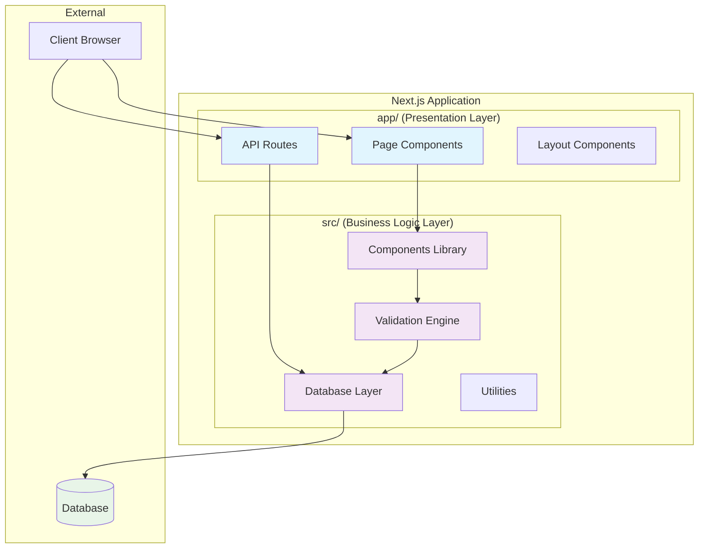
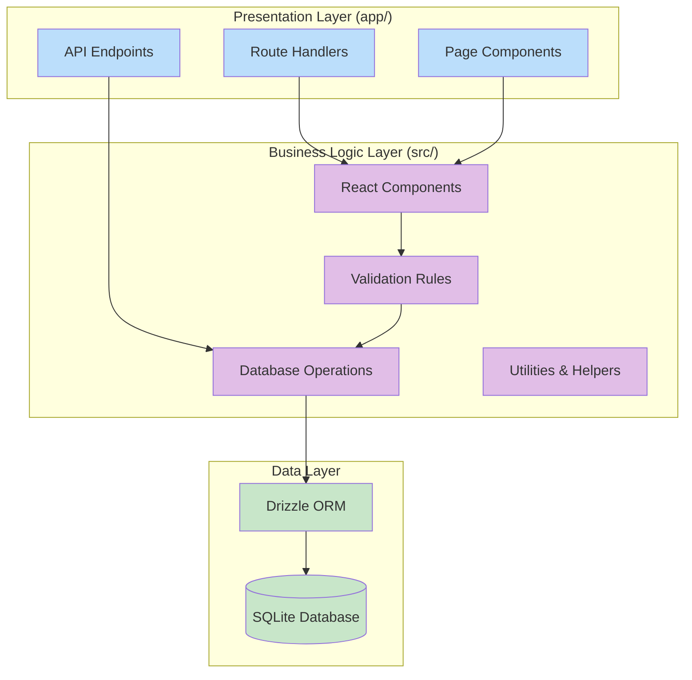
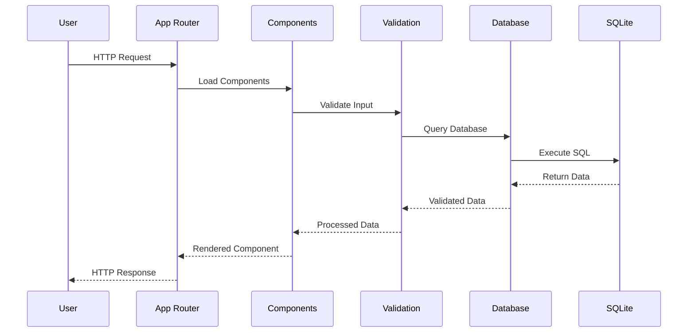
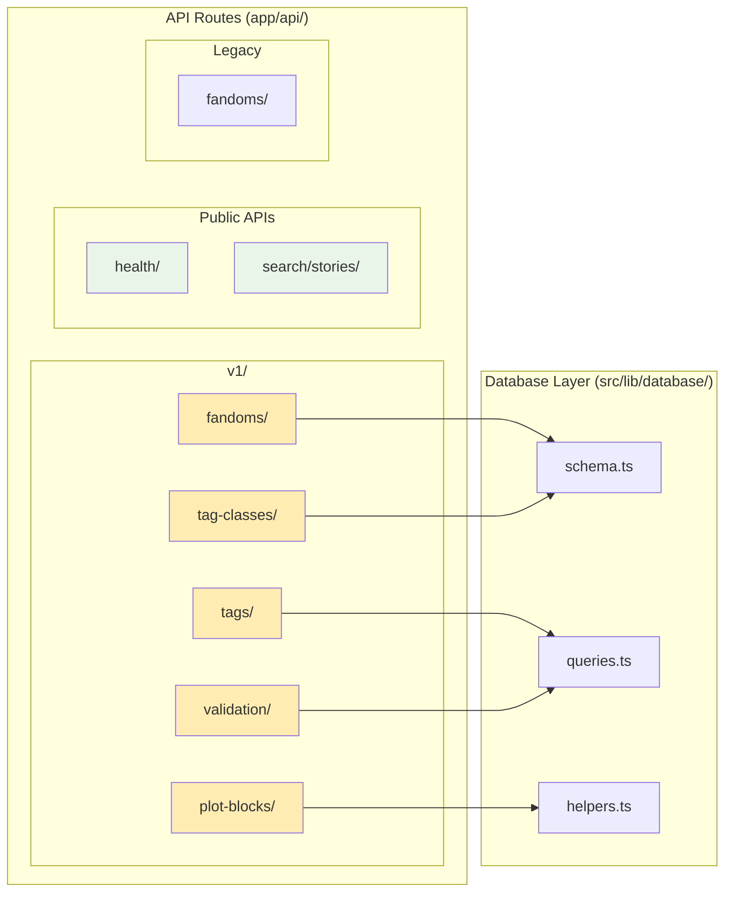
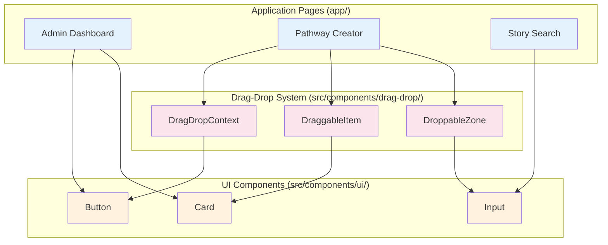
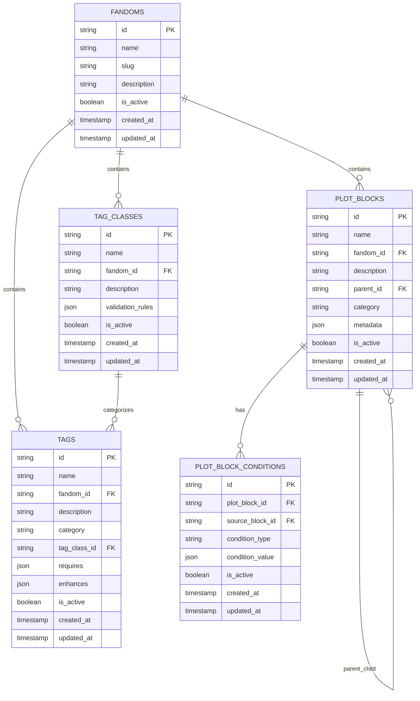
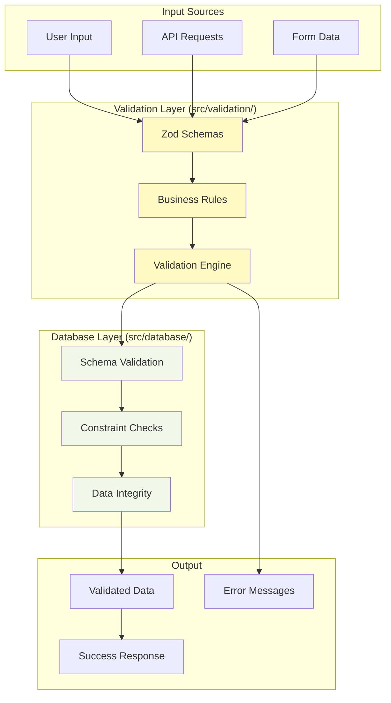
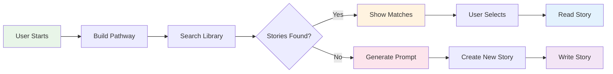

# The Pensive Index - Architecture Documentation

## 📋 Table of Contents
1. [Overview](#overview)
2. [Project Structure](#project-structure)
3. [Architecture Layers](#architecture-layers)
4. [Data Flow](#data-flow)
5. [API Structure](#api-structure)
6. [Component System](#component-system)
7. [Database Architecture](#database-architecture)
8. [Validation System](#validation-system)

## 🎯 Overview

The Pensive Index is a **library-first story discovery platform** for fanfiction that prioritizes finding existing tagged stories before generating new story prompts. It uses a modern, scalable architecture built with Next.js 13+ App Router.

## 🏗️ Project Structure

### High-Level Architecture

### Elements Explanation:
- **app/ (Presentation Layer)**: Next.js App Router structure containing routes, API endpoints, and page layouts
- **src/ (Business Logic Layer)**: Core application logic, reusable components, and utilities
- **API Routes**: RESTful endpoints for data operations (CRUD operations for fandoms, tags, etc.)
- **Page Components**: React components that render full pages
- **Components Library**: Reusable UI components and drag-drop functionality
- **Database Layer**: Drizzle ORM schemas, queries, and database utilities
- **Validation Engine**: Zod schemas and business rule validation
- **Utilities**: Helper functions, error handling, and performance monitoring

## 🔄 Architecture Layers

### Layer Separation Model

### Layer Responsibilities:

1. **Presentation Layer (app/)**:
   - **Route Handlers**: Handle HTTP requests and responses
   - **Page Components**: Render user interfaces
   - **API Endpoints**: Expose RESTful services

2. **Business Logic Layer (src/)**:
   - **React Components**: Reusable UI building blocks
   - **Database Operations**: Data access and manipulation
   - **Validation Rules**: Business logic and data validation
   - **Utilities & Helpers**: Common functionality and tools

3. **Data Layer**:
   - **SQLite Database**: Data storage
   - **Drizzle ORM**: Type-safe database queries

## 📊 Data Flow

### User Request Flow

### Flow Components:
- **User**: Browser client making requests
- **App Router**: Next.js routing system handling requests
- **Components**: React components from src/components
- **Validation**: Zod schemas and business rules from src/validation
- **Database**: Drizzle ORM operations from src/database
- **SQLite**: Actual database storage

## 🛣️ API Structure

### API Endpoint Organization

### API Endpoint Details:

**Versioned APIs (v1/)**:
- **fandoms/**: Manage fandoms (Harry Potter, Percy Jackson, etc.)
- **tags/**: Handle story tags (angst, fluff, time-travel)
- **plot-blocks/**: Manage plot elements (Goblin Inheritance, etc.)
- **tag-classes/**: Organize tags into validation groups
- **validation/**: Validate story pathway combinations

**Public APIs**:
- **health/**: System health checks
- **search/stories/**: Story discovery functionality

**Database Integration**:
- **schema.ts**: Drizzle ORM table definitions
- **queries.ts**: Complex query operations
- **helpers.ts**: CRUD operations and utilities

## 🎨 Component System

### Component Architecture

### Component Hierarchy:

**Base UI Components**:
- **Button**: Styled button with variants (primary, secondary, ghost)
- **Card**: Container component for content sections
- **Input**: Form input with validation states

**Drag-Drop Components**:
- **DragDropContext**: Provides drag-and-drop functionality using dnd-kit
- **DraggableItem**: Individual draggable elements (tags, plot blocks)
- **DroppableZone**: Areas where items can be dropped

**Application Pages**:
- **Admin Dashboard**: Management interface for content
- **Pathway Creator**: Main user interface for building story pathways
- **Story Search**: Discovery interface for finding existing stories

## 🗄️ Database Architecture

### Database Schema Structure

### Database Entity Descriptions:

**Core Entities**:
- **FANDOMS**: Top-level content categories (Harry Potter, Percy Jackson)
- **TAGS**: Story attributes and descriptors (angst, fluff, harry/hermione)
- **TAG_CLASSES**: Validation groups for tags (shipping, genres)
- **PLOT_BLOCKS**: Story structure elements (Goblin Inheritance, Time Travel)
- **PLOT_BLOCK_CONDITIONS**: Rules for plot block combinations

**Relationships**:
- Each fandom contains multiple tags, tag classes, and plot blocks
- Tag classes categorize and validate tag selections
- Plot blocks can have parent-child hierarchies
- Plot block conditions define interaction rules

## ✅ Validation System

### Validation Architecture

### Validation Components:

**Input Processing**:
- **User Input**: Form submissions and user interactions
- **API Requests**: HTTP request bodies and parameters
- **Form Data**: Structured form inputs

**Validation Layers**:
- **Zod Schemas**: Type-safe input validation and transformation
- **Business Rules**: Complex validation logic (tag conflicts, plot dependencies)
- **Validation Engine**: Orchestrates validation process

**Database Validation**:
- **Schema Validation**: Ensures data matches database schema
- **Constraint Checks**: Foreign key and unique constraint validation
- **Data Integrity**: Cross-table relationship validation

**Output Handling**:
- **Validated Data**: Clean, type-safe data ready for processing
- **Error Messages**: User-friendly validation error descriptions
- **Success Response**: Formatted successful operation results

## 🚀 Key Features

### Story Discovery Workflow

### Workflow Description:
1. **User Starts**: User accesses the platform
2. **Build Pathway**: Create story pathway using drag-drop or selection
3. **Search Library**: System searches existing tagged stories
4. **Decision Point**: Check if matching stories exist
5. **Show Matches**: Display relevant existing stories with scores
6. **Generate Prompt**: Create new story prompt highlighting novelty
7. **User Actions**: Either read existing stories or write new ones

This architecture ensures a clean separation of concerns, type safety throughout, and scalable development patterns for The Pensive Index platform.