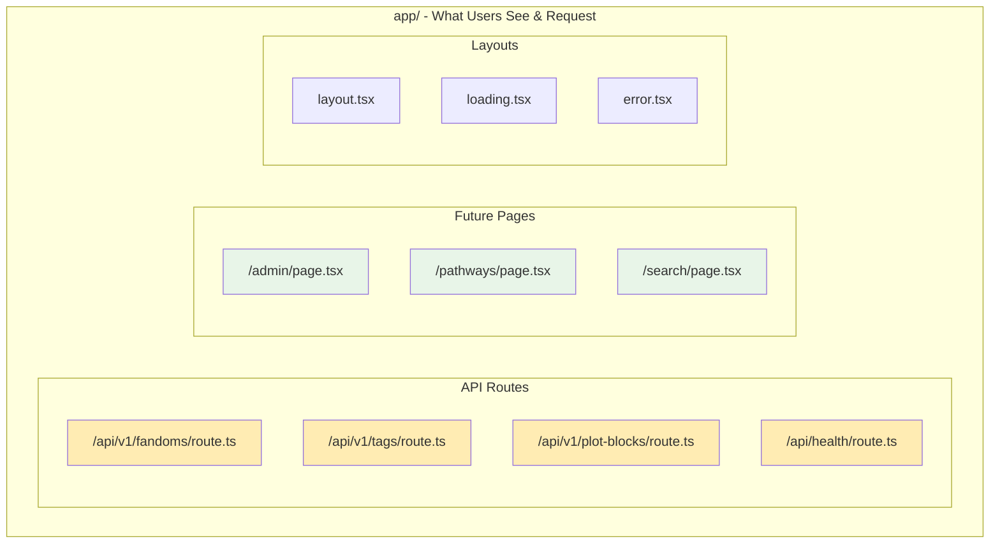
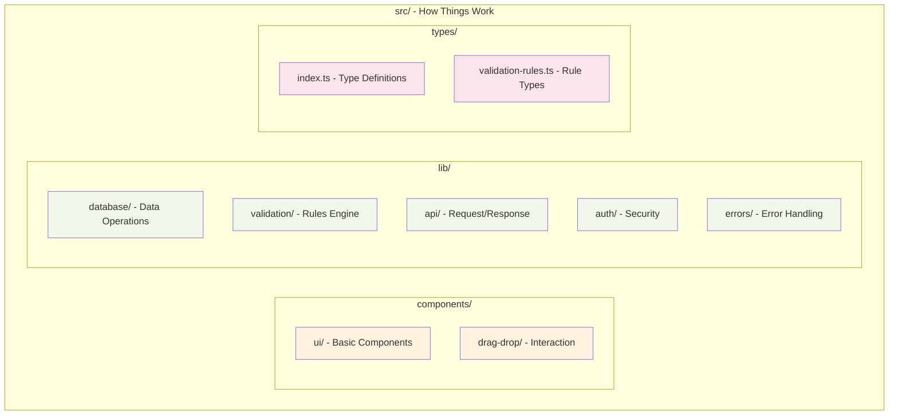
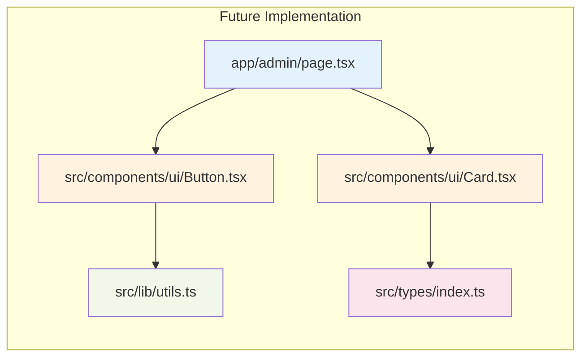

# Understanding src/ vs app/ Folder Structure

## 🤔 The Question: What's the Difference?

You're absolutely right to be confused! Let me explain the **src/** and **app/** folder structure clearly.

## 📁 Next.js 13+ App Router Structure

This project uses **Next.js 13+ with App Router**, which creates a specific folder structure:

```mermaid
graph TB
    subgraph "Project Root"
        subgraph "app/ - PRESENTATION LAYER"
            A1["📄 page.tsx files"]
            A2["🛣️ route.ts files (API)"]
            A3["🎨 layout.tsx files"]
            A4["📁 Route folders"]
        end

        subgraph "src/ - BUSINESS LOGIC LAYER"
            S1["⚛️ React Components"]
            S2["🗄️ Database Logic"]
            S3["✅ Validation Rules"]
            S4["🔧 Utilities"]
            S5["📊 Types"]
        end
    end

    A1 -.-> S1
    A2 -.-> S2
    A2 -.-> S3
    S1 -.-> S4
    S2 -.-> S5

    style A1 fill:#e3f2fd
    style A2 fill:#e3f2fd
    style A3 fill:#e3f2fd
    style A4 fill:#e3f2fd
    style S1 fill:#f3e5f5
    style S2 fill:#f3e5f5
    style S3 fill:#f3e5f5
    style S4 fill:#f3e5f5
    style S5 fill:#f3e5f5
```



### Explanation of Elements:

**app/ folder (Presentation Layer)**:
- **📄 page.tsx files**: React components that render full pages
- **🛣️ route.ts files**: API endpoints that handle HTTP requests
- **🎨 layout.tsx files**: Shared layouts for pages
- **📁 Route folders**: Folders that define URL structure

**src/ folder (Business Logic Layer)**:
- **⚛️ React Components**: Reusable UI components
- **🗄️ Database Logic**: Database schemas, queries, and operations
- **✅ Validation Rules**: Data validation and business rules
- **🔧 Utilities**: Helper functions and tools
- **📊 Types**: TypeScript type definitions

## 🎯 Why This Separation?

### Traditional Problem:

```mermaid
graph LR
    A[❌ Everything Mixed Together] --> B[😵 Hard to Maintain]
    B --> C[🐛 Bugs Everywhere]
    C --> D[😰 Developer Confusion]
```


### Our Solution:

```mermaid
graph LR
    A[✅ Clear Separation] --> B[😊 Easy to Maintain]
    B --> C[🎯 Focused Development]
    C --> D[🚀 Scalable Growth]
```


## 🔍 Detailed Breakdown

### app/ Folder Structure



**API Routes Purpose**:
- **fandoms/route.ts**: Handle HTTP requests for fandom management
- **tags/route.ts**: Process tag CRUD operations
- **plot-blocks/route.ts**: Manage plot block operations
- **health/route.ts**: System health monitoring

**Pages (Future)**:
- **admin/page.tsx**: Admin dashboard interface
- **pathways/page.tsx**: Story pathway creation interface
- **search/page.tsx**: Story search interface

### src/ Folder Structure



**Components Purpose**:
- **ui/**: Base components (Button, Card, Input) used everywhere
- **drag-drop/**: Specialized components for pathway building

**Library Purpose**:
- **database/**: All database-related code (schemas, queries, helpers)
- **validation/**: Business rules and data validation logic
- **api/**: Common API utilities (middleware, response formatting)
- **auth/**: Authentication and authorization logic
- **errors/**: Centralized error handling

**Types Purpose**:
- **index.ts**: Main TypeScript type definitions
- **validation-rules.ts**: Types for validation rules

## 🔄 How They Work Together

### Request Flow Example:

```mermaid
sequenceDiagram
    participant Browser
    participant App_Route as app/api/v1/fandoms/route.ts
    participant Src_DB as src/lib/database/
    participant Src_Val as src/validation/
    participant Database

    Browser->>App_Route: POST /api/v1/fandoms
    App_Route->>Src_Val: Validate request data
    Src_Val-->>App_Route: ✅ Valid data
    App_Route->>Src_DB: Create fandom
    Src_DB->>Database: INSERT query
    Database-->>Src_DB: Success
    Src_DB-->>App_Route: Created fandom
    App_Route-->>Browser: JSON response
```



**Flow Explanation**:
1. **Browser**: User makes API request
2. **app/route.ts**: Receives HTTP request
3. **src/validation/**: Validates the data
4. **src/database/**: Performs database operation
5. **Database**: Stores the data
6. **Response flows back**: Through the same chain

### Component Usage Example:



**Usage Explanation**:
- **app/admin/page.tsx**: Main admin page component
- **src/components/ui/**: Reusable UI building blocks
- **src/lib/utils.ts**: Shared utility functions
- **src/types/**: TypeScript type safety

## 📋 Current Status Summary

### ✅ What's Built (src/):

```mermaid
graph LR
    A[✅ Database Schemas] --> B[✅ API Logic]
    B --> C[✅ Validation Rules]
    C --> D[✅ UI Components]
    D --> E[✅ Drag-Drop System]

    style A fill:#c8e6c9
    style B fill:#c8e6c9
    style C fill:#c8e6c9
    style D fill:#c8e6c9
    style E fill:#c8e6c9
```


### ✅ What's Built (app/):

```mermaid
graph LR
    A[✅ API Endpoints] --> B[🔄 Working Routes]
    B --> C[✅ Error Handling]

    style A fill:#c8e6c9
    style B fill:#c8e6c9
    style C fill:#c8e6c9
```


### 🚧 What's Next:

```mermaid
graph LR
    A[🚧 Admin Pages] --> B[🚧 User Interface]
    B --> C[🚧 Story Search]
    C --> D[🚧 Pathway Creator]

    style A fill:#fff9c4
    style B fill:#fff9c4
    style C fill:#fff9c4
    style D fill:#fff9c4
```


## 💡 Key Takeaways

### Think of it like a restaurant:

```mermaid
graph TB
    subgraph "Restaurant Analogy"
        subgraph "app/ = Front of House"
            A1[👥 Waiters (API Routes)]
            A2[🍽️ Dining Room (Pages)]
            A3[📋 Menu (Layouts)]
        end

        subgraph "src/ = Back of House"
            S1[👨‍🍳 Chefs (Components)]
            S2[🥘 Kitchen (Database)]
            S3[📖 Recipes (Validation)]
            S4[🔧 Tools (Utilities)]
        end
    end

    A1 -.-> S2
    A2 -.-> S1
    S1 -.-> S3
    S2 -.-> S4

    style A1 fill:#e3f2fd
    style A2 fill:#e3f2fd
    style A3 fill:#e3f2fd
    style S1 fill:#f3e5f5
    style S2 fill:#f3e5f5
    style S3 fill:#f3e5f5
    style S4 fill:#f3e5f5
```

**Restaurant Analogy**:
- **app/ (Front of House)**: What customers see and interact with
- **src/ (Back of House)**: Where the actual work gets done
- **Waiters (API Routes)**: Take orders and serve responses
- **Dining Room (Pages)**: Where customers sit and experience the service
- **Chefs (Components)**: Create the actual "dishes" (UI elements)
- **Kitchen (Database)**: Where ingredients are stored and processed
- **Recipes (Validation)**: Rules for how things should be made
- **Tools (Utilities)**: Equipment that makes everything work

## 🎯 Summary

- **app/**: The "public face" - handles requests and renders pages
- **src/**: The "engine room" - contains all the logic and components
- **They work together**: app/ uses src/ to do the actual work
- **Clean separation**: Makes code easier to understand and maintain
- **Scalable**: Can grow without becoming messy

This structure allows us to build complex features while keeping the code organized and maintainable!